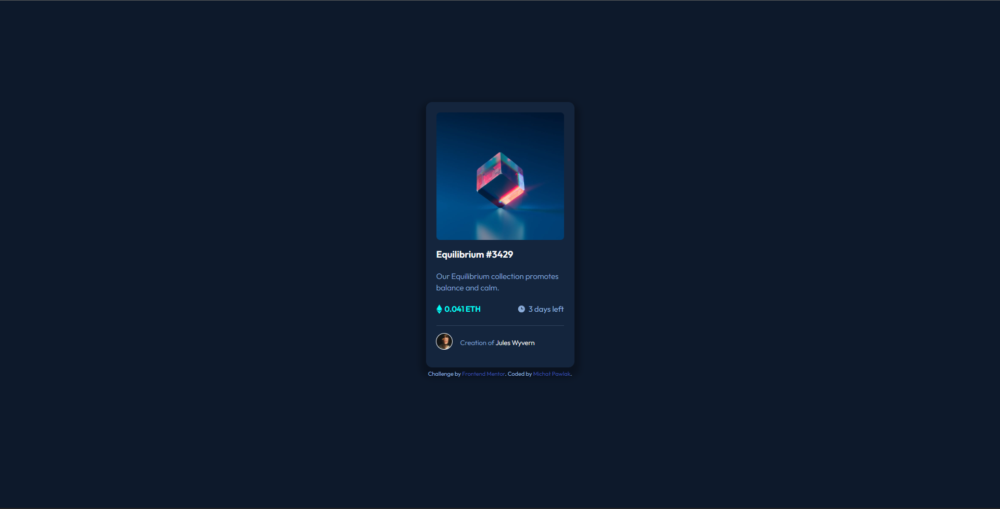
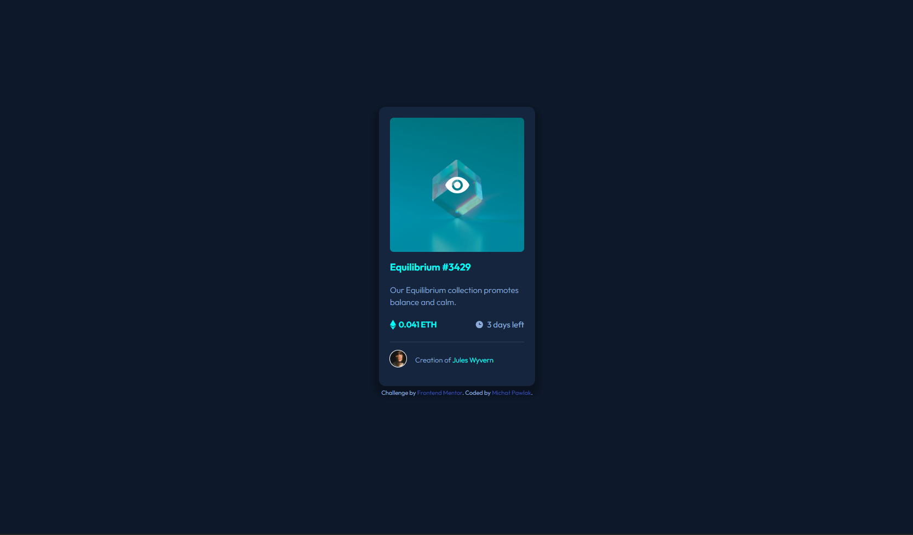

# Frontend Mentor - NFT preview card component solution

This is a nice and elegant solution with transitions, flexbox and pseudo-elements.

## Table of contents

- [Overview](#overview)
  - [The challenge](#the-challenge)
  - [Screenshot](#screenshot)
  - [Links](#links)
- [My process](#my-process)
  - [Built with](#built-with)
  - [What I learned](#what-i-learned)
- [Author](#author)

## Overview

### The challenge

Users are be able to:

- View the optimal layout depending on their device's screen size
- See hover states for interactive elements

### Screenshot

### Links

- Solution URL: https://github.com/MichalPawlak0/Frontend-Mentor-NFT-Preview-Component
- Live Site URL: michal-pawlak-nft-preview-card.netlify.app

## My process

### Built with

- Semantic HTML5 markup
- CSS custom properties
- Flexbox

### What I learned

I learnt that you can style one element while the other is hovered over by using the + (sibling) selector or > (child).

## Author

- Website - [Michał Pawlak](https://michal-pawlak.netlify.app/)
- Frontend Mentor - [@MichalPawlak0](https://www.frontendmentor.io/profile/MichalPawlak0)
